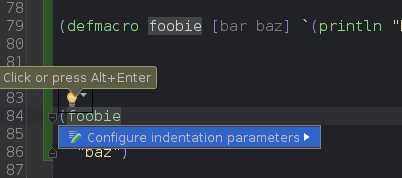
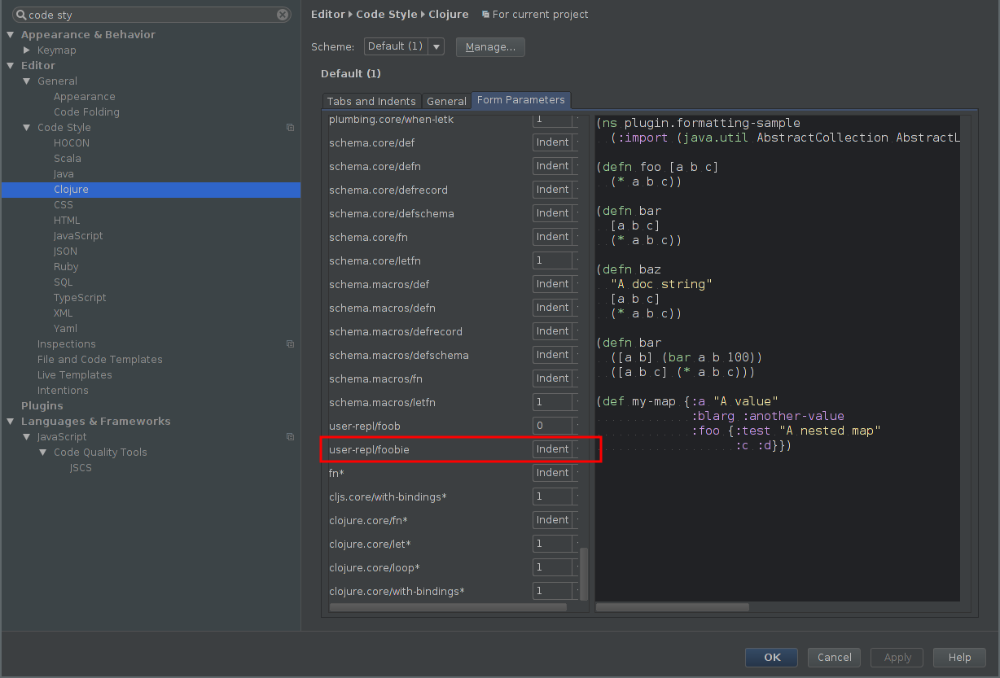

# pl-clojure-style

Centralized clojure style settings for puppetlabs projects

## Usage

This is meant to be used from source as a parent project using lein-parent.
Check this out next to the project you want to format. Merge into your
project.clj:

```clojure
  :profiles {:cljfmt {:plugins [[lein-cljfmt "0.3.0"]
                                [lein-parent "0.2.1"]]
                      :parent-project {:path "../pl-clojure-style/project.clj"
                                       :inherit [:cljfmt]}}}
  :aliases {"cljfmt" ["with-profile" "+cljfmt" "cljfmt"]}
```

Using a profile makes it possible to run normal lein commands without having
this repository present.


Then run

```
lein cljfmt check
```
to get a report of the formatting issues, and

```
lein cljfmt fix
```

to fix the formatting.

Both of these commands take an optional argument of a file path, to check or
fix a specific file.

For more information, see the documentation for
[cljfmt](https://github.com/weavejester/cljfmt), the library this uses.

## Other style considerations

There are a few things that aren't automatically enforced by cljfmt.

### Line length

Not a hard rule, but try to keep it under 80 characters.

### Aligning values in maps and lets

Don't.

Good:
```clojure
{:key "some stuff"
 :another_much_longer_key "other stuff"}
```
Bad:
```clojure
{:key                     "some stuff"
 :another_much_longer_key "other stuff"}
```


## Editor specific settings

### Vim

Add the settings from [indents.vim](indents.vim) to your .vimrc.

### Emacs

Add the settings from [indents.el](indents.el) to your emacs
configuration.

### Cursive Clojure in IntelliJ

You should set the general indentation settings as shown:


To set indentation parameters for custom macros, place the cursor on a call to the
macro, and wait for the light-bulb icon to appear.  Click it and then click on
"Configure Indentation parameters":



After that your custom form should appear in the 'Form Parameters' settings, so you
can modify the indentation rules there if you choose:



Also... it's possible to export these settings from Cursive as a jar file that others
can import.  Once we get some mileage on this stuff, we should probably do that and
include the jar here.

